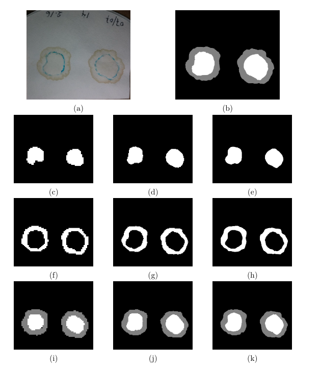

# Aplicação de Redes Neurais Convolucionais na Classificação de Amostras de Carne Suína por Meio da Capacidade de Retenção de Água

Para analisar a qualidade de carne Suínas podemos utilizar várias técnicas, entre elas podemos destacar a capacidade de retenção de água (CRA). Normalmente, a CRA é estimada medindo o suco liberado após a compressão de amostras de carne.

Entretanto, após gerar as marcações no filtro de papel, ainda é necessário a presença de profissional para analisar as amostras, esse trabalho sugere a utilização de redes neurais convolucionais para a segmentação automática das fotos dessas amostras. 

Para tanto utilizamos a arquitetura **Unet** e avaliamos duas abordagem: 

- segmentação binária utilizando a função de ativação sigmoide;
- segmentação multi classe utilizando a função de ativação softmax.

Através de experimentos demonstramos a superioridade da segmentação multi classe que apresentou uma média de 97,78% utilizando a função de métrica IoU.

## Exempo de Resultado:

